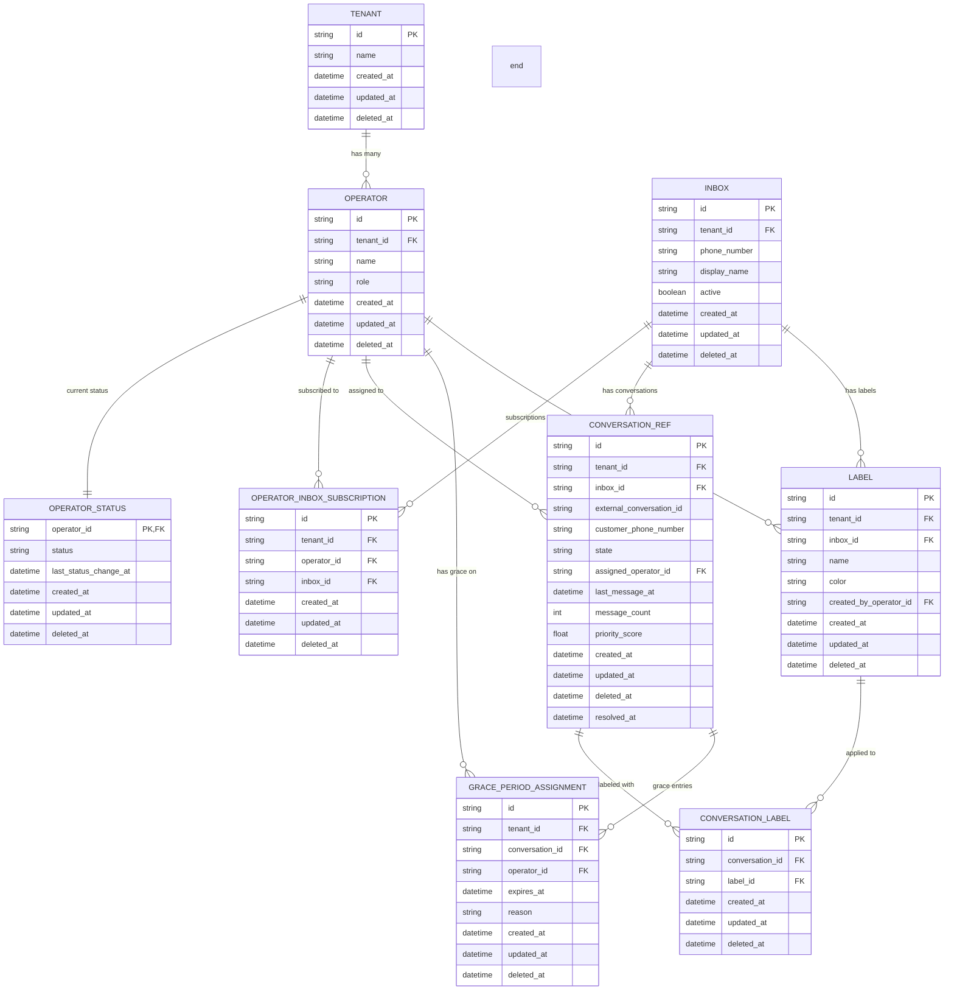
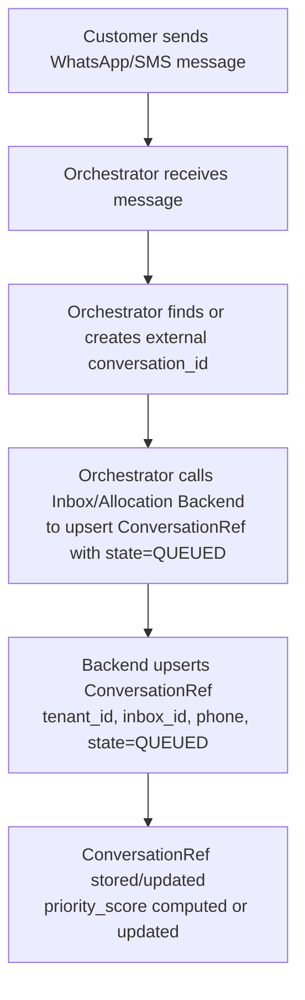
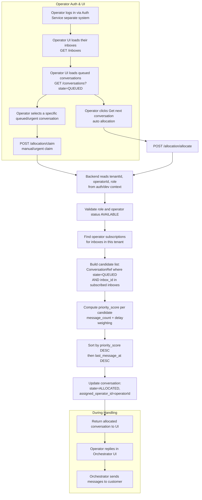
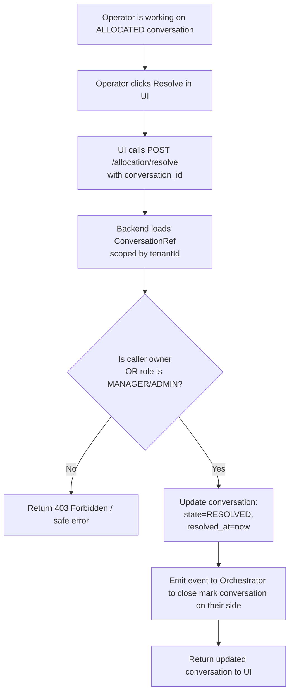

# Architecture

> Inbox & Allocation backend for multi-tenant routing, allocation, and operator availability.

## Quick links

- [1. Context & scope](#1-context--scope)
- [2. Domain model](#2-domain-model)
- [3. Key constraints & invariants](#3-key-constraints--invariants)
- [4. Domain flows](#4-domain-flows)
- [5. Module & layering overview](#5-module--layering-overview-nestjs)

## 0. Tech snapshot

| Aspect       | Choice                                             |
| ------------ | -------------------------------------------------- |
| Framework    | NestJS (TypeScript)                                |
| Persistence  | PostgreSQL via TypeORM                             |
| API style    | REST + Swagger/OpenAPI at `/docs`                  |
| Auth context | DevTokenGuard (injects tenantId, operatorId, role) |
| Logging      | Pino, structured and contextual                    |

---

## 1. Context & scope

This service implements the backend for the Inbox and Allocation system in a **multi-tenant** environment.

**What this service does**

- Manages **inboxes** per tenant, each mapped to one phone number.
- Manages **operators** and their **roles** (`OPERATOR`, `MANAGER`, `ADMIN`).
- Manages **operator–inbox subscriptions** to define which inboxes an operator can work on.
- Stores **conversation metadata** (tenant, inbox, external id, phone, state, assigned operator, timestamps, priority).
- Implements **auto allocation** and **manual claim**.
- Manages **labels** and tagging of conversations.
- Tracks **operator availability** and **grace periods** when going offline.
- Provides simple **search** (by phone) and **filtered conversation listing**.

**Out of scope / handled elsewhere**

- Contact management (full CRM).
- Login/auth flows (only a dev/auth guard to simulate identity and tenant).
- Message history storage.
- Message delivery to external channels (WhatsApp, SMS, etc.).

The external **orchestrator** owns message ingestion, history, and delivery. This backend focuses on routing, allocation, and metadata.

---

## 2. Domain model

### 2.1. Core entities (at a glance)

| Entity                    | Purpose                            | Key points                                              |
| ------------------------- | ---------------------------------- | ------------------------------------------------------- |
| Tenant                    | Customer/account of the platform   | Scopes operators, inboxes, conversations, labels        |
| Operator                  | User handling conversations        | One tenant; roles: OPERATOR/MANAGER/ADMIN               |
| Inbox                     | Channel per tenant (phone number)  | One phone per inbox per tenant                          |
| OperatorInboxSubscription | Operator ↔ Inbox link             | Defines which inboxes an operator can see/receive       |
| ConversationRef           | Conversation metadata              | Belongs to one inbox; holds state, priority, timestamps |
| Label                     | Business tags per inbox            | Not global; created by operators                        |
| ConversationLabel         | Conversation ↔ Label link         | Many-to-many                                            |
| OperatorStatus            | Availability                       | `AVAILABLE` or `OFFLINE`, with last change              |
| GracePeriodAssignment     | Grace window for offline operators | Expires to return conversations to queue                |

### 2.2. Core entity notes

- **Tenant**: Scopes all resources by `tenantId`.
- **Operator**: Belongs to one tenant; role drives authorization.
- **Inbox**: Identified by `phone_number`; represents channels like “Support WhatsApp”.
- **OperatorInboxSubscription**: Many-to-many; inbox visibility and allocation eligibility.
- **ConversationRef**:
  - Metadata only (not history): `tenant_id`, `inbox_id`, `external_conversation_id`, `customer_phone_number`.
  - State machine: `QUEUED`, `ALLOCATED`, `RESOLVED`.
  - Assignment fields: `assigned_operator_id`, `last_message_at`, `message_count`, `priority_score`, timestamps.
  - Belongs to exactly one inbox.
- **Label**: Per tenant and inbox; examples `vip`, `fraud`, `billing`.
- **ConversationLabel**: Many-to-many between conversations and labels.
- **OperatorStatus**: Availability flag; avoids allocating to offline operators.
- **GracePeriodAssignment**: Pending grace for conversations when an operator goes offline; expires to re-queue.

### 2.3. Entity–Relationship Diagram

---

## 3. Key constraints & invariants || No negotiable business logic

**Phone → Inbox mapping**

- One phone number per inbox per tenant (`UNIQUE(tenant_id, phone_number)`).

**Conversation → Inbox**

- Each conversation belongs to exactly one inbox (`conversation_ref.inbox_id` required).

**Conversation lifecycle**

- Valid states: `QUEUED`, `ALLOCATED`, `RESOLVED`.
- Allowed transitions:
  - `QUEUED` → `ALLOCATED` (auto allocation or manual claim).
  - `ALLOCATED` → `RESOLVED` (resolve action).
  - `ALLOCATED` → `QUEUED` (deallocation or grace expiry).
- Disallowed examples: `QUEUED` → `RESOLVED`, `RESOLVED` → `ALLOCATED`.

**Labels scoped by inbox**

- Labels are per tenant and inbox; only labels from the conversation’s inbox can be applied.

**Multi-tenant isolation**

- All queries are scoped by `tenantId`; cross-tenant access via IDs alone is not possible.

**Operator status & grace**

- Going OFFLINE creates grace assignments instead of immediate deallocation.
- Expired grace entries re-queue conversations if the operator stays offline.

---

## 4. Domain flows

### 4.1. Message ingestion & conversation creation (QUEUED)

The orchestrator owns message ingestion and keeps this backend in sync with conversation existence and state.

Key points:

- Orchestrator: source of truth for history; backend: source of truth for metadata.
- Conversations upserted in `QUEUED` when new messages arrive and no operator is handling them.
- `priority_score` can be recalculated per upsert (message count + delay).

Ideas to extend:

- Orchestrator webhook to notify new conversation reception.  
  Impact: Faster state sync; less allocation lag and fewer missed conversations.
- Request last 5 user messages to build a sentiment/feeling detector for operator alerts.  
  Impact: Proactive triage and priority for upset/VIP users; improves CSAT/NPS.

### 4.2. Auto allocation & handling by operator

Operators work through a UI talking to this backend plus a separate Auth service.

Key points:

- Allocation is atomic; no double assignment.
- Manual/urgent claim uses the same auth/tenant/subscription guards as auto allocation.
- Priority blends normalized message count and delay.

Ideas to extend:

- Offer prioritized manual “claim” for VIP/high-value sales queues.  
  Impact: Better handling of revenue-critical leads; higher conversion likelihood.
- Open a “high-touch” queue with tenant-specific SLAs and success metrics.  
  Impact: Differentiated service tiers; supports premium upsell and SLA adherence.
- Allow allocation windows per inbox (e.g., 24/7 support vs. business-hours sales).  
  Impact: Staffing aligned to demand; shorter waits and reduced off-hour leakage.
- Allow an “urgent” flag on manual claims with manager override and audit.  
  Impact: Faster rescue of at-risk conversations; controlled override reduces abuse.

### 4.3. Resolve flow

When an operator finishes, they resolve the conversation.

Key points:

- Only assigned operator or MANAGER/ADMIN can resolve.
- After resolve: state `RESOLVED`, `resolved_at` set, no longer eligible for allocation.
- Optional event can close the conversation on the orchestrator side.

Ideas to extend:

- Capture closure reason (business categories) for reporting and client feedback.  
  Impact: Actionable insights on churn drivers; better product/support loops.
- Trigger post-resolution satisfaction surveys by channel and inbox.  
  Impact: Direct channel-level feedback; targeted quality improvements.
- Measure “first response” and “time-to-resolve” by inbox/role for performance OKRs.  
  Impact: Clear operational KPIs; improves coaching and capacity planning.

### 4.4. Operator status & grace period

Availability affects allocation; going offline should not instantly drop work.

```mermaid
flowchart TD

subgraph Status Change
  S1[Operator changes status to OFFLINE in UI] --> S2[UI calls POST /operator-status/me<br/> status: OFFLINE ]
  S2 --> S3[Backend updates OperatorStatus<br/>status=OFFLINE, last_status_change_at=now]
  S3 --> S4[Backend finds all ALLOCATED conversations<br/>assigned to this operator]
  S4 --> S5[Create GracePeriodAssignment for each:<br/>tenantId, operatorId, conversationId,<br/>expiresAt = now + grace_window]
end

subgraph Grace Processing
  G1[Background job or POST /grace-period/process] --> G2[Load all GracePeriodAssignment<br/>where expiresAt <= now]
  G2 --> G3{For each assignment:<br/>operator still OFFLINE<br/>and conversation still ALLOCATED<br/>to that operator?}
  G3 -->|Yes| G4[Update conversation:<br/>state=QUEUED,<br/>assigned_operator_id=null]
  G4 --> G5[Delete GracePeriodAssignment row]
  G3 -->|No| G6[Delete GracePeriodAssignment row<br/>operator AVAILABLE or conversation changed]
end

subgraph Back to AVAILABLE
  B1[Operator changes status to AVAILABLE] --> B2[UI calls POST /operator-status/me<br/> status: AVAILABLE ]
  B2 --> B3[Backend updates OperatorStatus<br/>status=AVAILABLE, last_status_change_at=now]
  B3 --> B4[Delete all pending GracePeriodAssignment<br/>for this operator and tenant]
end
```

Key points:

- Grace logic is triggered by status changes, not allocation endpoints.
- Operators can temporarily disconnect without losing work.
- Expired grace entries ensure conversations do not stay stuck on offline operators.

Ideas to extend:

- Configure grace windows per inbox (e.g., sales vs. critical support).  
  Impact: Tailored resilience per line of business; balances speed vs. continuity.
- Offer a short “snooze” (5–10 min) before going fully OFFLINE.  
  Impact: Reduces accidental drops; smooths short interruptions without requeue churn.
- Alert managers when offline-operator thresholds are reached per tenant.  
  Impact: Early warning on capacity risk; prevents backlog spikes and SLA breaches.

---

## 5. Module & layering overview (NestJS)

Feature modules align with the domain:

- `TenantsModule` (if implemented): tenant-level configuration.
- `OperatorsModule`: operators and roles.
- `InboxesModule`: inbox management and phone mapping.
- `OperatorInboxSubscriptionsModule`: operator ↔ inbox subscriptions.
- `ConversationsModule`: CRUD and listing for `ConversationRef`.
- `AllocationModule`: state transitions and allocation logic.
- `LabelsModule`: label definitions and tagging.
- `OperatorStatusModule`: availability.
- `GracePeriodModule`: processing grace assignments (job/endpoint).
- `SearchModule` (or part of Conversations): search by phone number.

Cross-cutting:

- Auth context via DevTokenGuard (tenantId, operatorId, role injection).
- Persistence: PostgreSQL with TypeORM; repositories per entity (no in-memory stores).
- API docs: Swagger/OpenAPI at `/docs`.
- Logging: Pino for structured, contextual logs.
