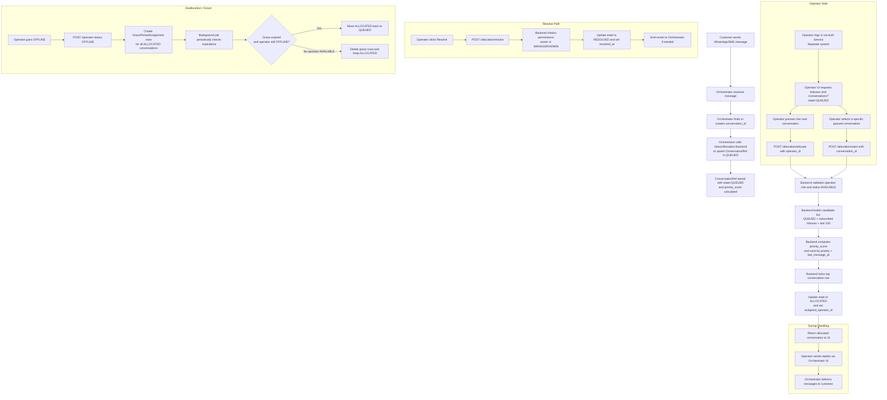

# Inbox & Allocation Service

## Overview

This project is a backend service that provides **inbox and allocation capabilities for operators** in a **multi-tenant** environment.

It is intentionally focused on **metadata only**:

- It **does not handle**:
  - contact management,
  - authentication/login,
  - message history storage,
  - message delivery to external channels.
- Those responsibilities belong to an external **orchestrator** service.

Instead, this backend answers questions like:

- Which tenant and inbox does this conversation belong to?
- What is the current **state** of the conversation (QUEUED / ALLOCATED / RESOLVED)?
- Which **operator** is responsible for it?
- Which **labels** (business tags) are attached to the conversation?
- Is the operator **AVAILABLE** or **OFFLINE**?
- What happens to their conversations when they go offline (grace period and re-queueing)?
- What is the next conversation that should be auto-allocated based on priority?

The service exposes a clean API for agent UIs, supervisor consoles and automation tools to:

- list and filter conversations,
- allocate/claim/resolve/reassign work,
- manage inboxes and labels,
- track operator status and apply grace periods,
- search conversations by id, phone number, inbox and operator.

---

## Tech Stack

- **Runtime / Framework**: [NestJS](https://nestjs.com/)
- **Database**: PostgreSQL
- **ORM / Persistence**: TypeORM
- **Package manager**: `pnpm`
- **API documentation**: Swagger (OpenAPI) exposed via `/api`
- **Testing**: Jest
- **CI/CD**: GitHub Actions

---

## Production URL

Live deployment: https://zendly-tech-test.onrender.com

---

## Running the project locally

### Prerequisites

- Docker & Docker Compose
- Node.js (compatible with Nest)
- `pnpm` installed globally

### Steps

1. **Start the database with Docker Compose**

```bash
docker compose up -d
```

This will bring up the PostgreSQL instance (and any other dependent services defined in docker-compose.yml).

2. Install dependencies

```bash
pnpm install
```

3. Run database migrations

```bash
pnpm run db:run
```

4. Start the NestJS application

```bash
pnpm run start:dev
```

5. Access API documentation (Swagger)

Once the app is running, open:

Swagger UI: https://zendly-tech-test.onrender.com/api

(Replace <PORT> with the configured HTTP port, typically 3000.)

---

## Functional overview

At a high level, the service implements the domain described in the “Backend requirements for Inbox and Allocation system” document and exposes the capabilities below.

## Documentation

The following documents provide more detailed information about this service:

- [Architecture](./ARCHITECTURE.md) – Domain model, ERD, and main flows.
- [Design Decisions](./DESIGN_DECISIONS.md) – How the original spec was interpreted and implemented.
- [API Reference](./API.md) – Detailed list of endpoints, parameters, and responses.
- [Testing](./TESTING.md) – Manual and automated testing strategy and flow coverage.

### Multi-tenant model

- Every resource is scoped by `tenantId`.
- Operator: belongs to a tenant and has one role (`OPERATOR`, `MANAGER`, or `ADMIN`).
- Inbox: belongs to a tenant and has a unique `phone_number` per tenant (one number maps to one inbox).
- Operator–Inbox subscriptions: define which inboxes an operator can work on and therefore which conversations they can see/allocate.

### Conversations & lifecycle

- `ConversationRef` stores: `tenant_id`, `inbox_id`, `external_conversation_id` (orchestrator), `customer_phone_number`, `state` (`QUEUED` | `ALLOCATED` | `RESOLVED`), `assigned_operator_id` (nullable), `last_message_at`, `message_count`, `priority_score`, timestamps (`created_at`, `updated_at`, `resolved_at`).
- Each conversation belongs to exactly one inbox.
- Lifecycle transitions:
  - `QUEUED` → `ALLOCATED` via auto allocation or manual claim.
  - `ALLOCATED` → `RESOLVED` via resolve.
  - `ALLOCATED` → `QUEUED` via deallocation or grace-period expiration.

### Allocation modes

- Auto allocation (`POST /allocation/allocate`)
  1. Validate operator role, status, and subscriptions.
  2. Build QUEUED candidates from subscribed inboxes (most recent 100).
  3. Compute `priority_score` (weighted message count + delay) and sort by priority then `last_message_at`.
  4. Lock the top conversation, set state to `ALLOCATED`, assign operator, return the record.
- Manual claim (`POST /allocation/claim`)
  - Operator picks a specific QUEUED conversation; service attempts to lock/assign and returns the updated record or a safe failure if already taken.
- Other allocation actions
  - `POST /allocation/resolve`: `ALLOCATED` → `RESOLVED` (owners/managers/admins).
  - `POST /allocation/deallocate`: `ALLOCATED` → `QUEUED` and clear `assigned_operator_id`.
  - `POST /allocation/reassign`: move `assigned_operator_id` between operators in the same tenant.
  - `POST /allocation/move-inbox`: move a conversation to another inbox within the same tenant with controlled state handling.

### Labels & tagging

- `Label`: defined per tenant and inbox; fields include `name`, optional `color`, `created_by`, `created_at`.
- `ConversationLabel`: many-to-many between conversations and labels to tag items (e.g., vip, fraud, billing, complaint).
- API supports CRUD on labels plus attach/detach labels to/from conversations.

### Operator status & grace period

- `OperatorStatus` tracks whether an operator is `AVAILABLE` or `OFFLINE` and updates `last_status_change_at`.
- `GracePeriodAssignment`: when an operator goes `OFFLINE`, create grace assignments for their `ALLOCATED` conversations.
  - A scheduled job/endpoint checks expirations.
  - If expired and operator still offline → conversation returns to `QUEUED`.
  - If operator becomes `AVAILABLE` before expiry → pending grace rows are removed and conversations stay `ALLOCATED`.
  - Prevents conversations from being dropped instantly while also avoiding them getting stuck.

### Search & conversation listing

- Search by phone number: exact match on `customer_phone_number`, ordered by most recent activity.
- Conversation listing (`GET /conversations`):
  - Filters: `inboxId`, `state` (`QUEUED` | `ALLOCATED` | `RESOLVED`), `assignedOperatorId`, `customerPhoneNumber` (exact match).
  - Sorting: newest, oldest, or priority.
  - Pagination: hard cap (e.g., last 100) for performance and polling efficiency.

user flow


