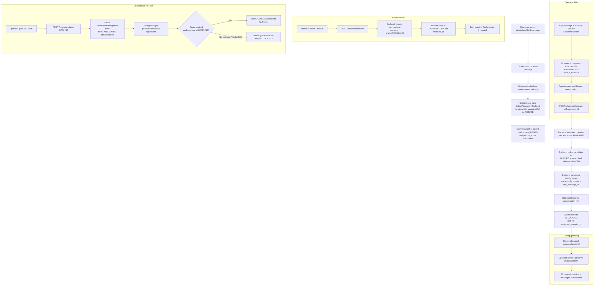
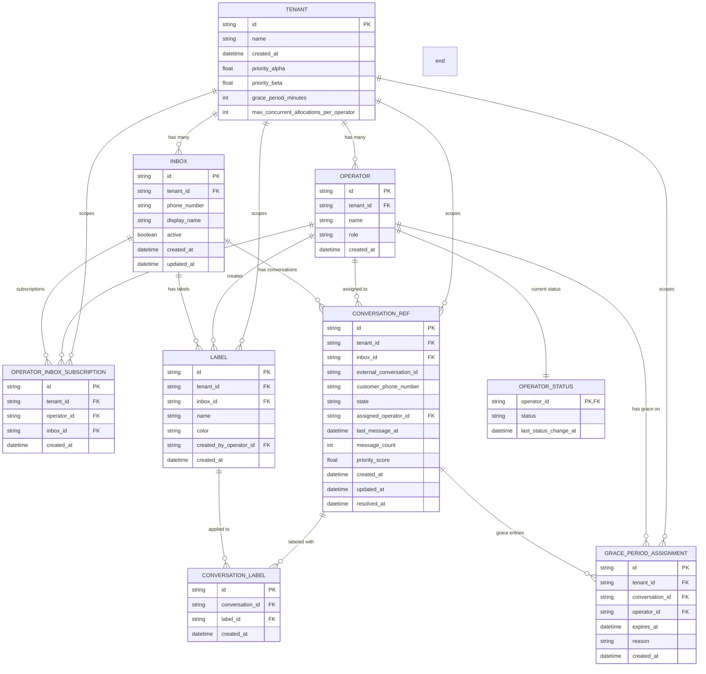

user flow

```mermaid
flowchart TD

A[Customer sends WhatsApp/SMS message] --> B[Orchestrator receives message]

B --> C[Orchestrator finds or creates conversation_id]

C --> D[Orchestrator calls Inbox/Allocation Backend<br/>to upsert ConversationRef in QUEUED]

D --> E[ConversationRef stored with state=QUEUED<br/>and priority_score calculated]

subgraph Operator Side

  F[Operator logs in via Auth Service<br/>Separate system]

  F --> G[Operator UI requests /inboxes and /conversations?state=QUEUED]

  G --> H[Operator presses Get next conversation]

  H --> I[POST /allocation/allocate with operator_id]

end

I --> J[Backend validates operator role and status AVAILABLE]

J --> K[Backend builds candidate list:<br/>QUEUED + subscribed inboxes + last 100]

K --> L[Backend computes priority_score<br/>and sorts by priority + last_message_at]

L --> M[Backend locks top conversation row]

M --> N[Update state to ALLOCATED<br/>and set assigned_operator_id]

N --> O[Return allocated conversation to UI]

subgraph During Handling

  O --> P[Operator sends replies via Orchestrator UI]

  P --> Q[Orchestrator delivers messages to customer]

end

subgraph Resolve Path

  R[Operator clicks Resolve] --> S[POST /allocation/resolve]

  S --> T[Backend checks permissions:<br/>owner or MANAGER/ADMIN]

  T --> U[Update state to RESOLVED and set resolved_at]

  U --> V[Emit event to Orchestrator if needed]

end

subgraph Deallocation / Grace

  W[Operator goes OFFLINE] --> X[POST /operator-status OFFLINE]

  X --> Y[Create GracePeriodAssignment rows<br/>for all ALLOCATED conversations]

  Y --> Z[Background job periodically checks expirations]

  Z --> ZA{Grace expired<br/>and operator still OFFLINE?}

  ZA -->|Yes| ZB[Move ALLOCATED back to QUEUED]

  ZA -->|No operator AVAILABLE| ZC[Delete grace rows and keep ALLOCATED]

end
```

entity relation

```mermaid
erDiagram

TENANT {
string id PK
string name
datetime created_at
float priority_alpha
float priority_beta
int grace_period_minutes
int max_concurrent_allocations_per_operator
}

OPERATOR {
string id PK
string tenant_id FK
string name
string role
datetime created_at
}

INBOX {
string id PK
string tenant_id FK
string phone_number
string display_name
boolean active
datetime created_at
datetime updated_at
}

OPERATOR_INBOX_SUBSCRIPTION {
string id PK
string tenant_id FK
string operator_id FK
string inbox_id FK
datetime created_at
}

CONVERSATION_REF {
string id PK
string tenant_id FK
string inbox_id FK
string external_conversation_id
string customer_phone_number
string state
string assigned_operator_id FK
datetime last_message_at
int message_count
float priority_score
datetime created_at
datetime updated_at
datetime resolved_at
}

LABEL {
string id PK
string tenant_id FK
string inbox_id FK
string name
string color
string created_by_operator_id FK
datetime created_at
}

CONVERSATION_LABEL {
string id PK
string conversation_id FK
string label_id FK
datetime created_at
}

OPERATOR_STATUS {
string operator_id PK, FK
string status
datetime last_status_change_at
}

GRACE_PERIOD_ASSIGNMENT {
string id PK
string tenant_id FK
string conversation_id FK
string operator_id FK
datetime expires_at
string reason
datetime created_at
}

TENANT ||--o{ OPERATOR : "has many"
TENANT ||--o{ INBOX : "has many"
TENANT ||--o{ OPERATOR_INBOX_SUBSCRIPTION : "scopes"
TENANT ||--o{ CONVERSATION_REF : "scopes"
TENANT ||--o{ LABEL : "scopes"
TENANT ||--o{ GRACE_PERIOD_ASSIGNMENT : "scopes"

OPERATOR ||--|| OPERATOR_STATUS : "current status"
OPERATOR ||--o{ OPERATOR_INBOX_SUBSCRIPTION : "subscribed to"
OPERATOR ||--o{ CONVERSATION_REF : "assigned to"
OPERATOR ||--o{ GRACE_PERIOD_ASSIGNMENT : "has grace on"
OPERATOR ||--o{ LABEL : "creates"

INBOX ||--o{ OPERATOR_INBOX_SUBSCRIPTION : "subscriptions"
INBOX ||--o{ CONVERSATION_REF : "has conversations"
INBOX ||--o{ LABEL : "has labels"

CONVERSATION_REF ||--o{ CONVERSATION_LABEL : "labeled with"
LABEL ||--o{ CONVERSATION_LABEL : "applied to"

CONVERSATION_REF ||--o{ GRACE_PERIOD_ASSIGNMENT : "grace entries"
end
```
