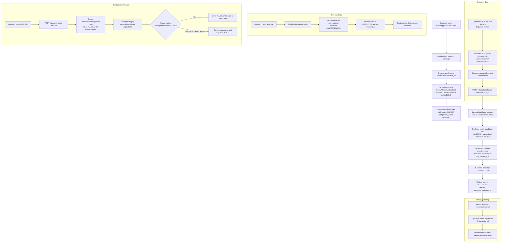

```mermaid
flowchart TD

A[Customer sends WhatsApp/SMS message] --> B[Orchestrator receives message]

B --> C[Orchestrator finds or creates conversation_id]

C --> D[Orchestrator calls Inbox/Allocation Backend<br/>to upsert ConversationRef in QUEUED]

D --> E[ConversationRef stored with state=QUEUED<br/>and priority_score calculated]

subgraph Operator Side

  F[Operator logs in via Auth Service<br/>Separate system]

  F --> G[Operator UI requests /inboxes and /conversations?state=QUEUED]

  G --> H[Operator presses Get next conversation]

  H --> I[POST /allocation/allocate with operator_id]

end

I --> J[Backend validates operator role and status AVAILABLE]

J --> K[Backend builds candidate list:<br/>QUEUED + subscribed inboxes + last 100]

K --> L[Backend computes priority_score<br/>and sorts by priority + last_message_at]

L --> M[Backend locks top conversation row]

M --> N[Update state to ALLOCATED<br/>and set assigned_operator_id]

N --> O[Return allocated conversation to UI]

subgraph During Handling

  O --> P[Operator sends replies via Orchestrator UI]

  P --> Q[Orchestrator delivers messages to customer]

end

subgraph Resolve Path

  R[Operator clicks Resolve] --> S[POST /allocation/resolve]

  S --> T[Backend checks permissions:<br/>owner or MANAGER/ADMIN]

  T --> U[Update state to RESOLVED and set resolved_at]

  U --> V[Emit event to Orchestrator if needed]

end

subgraph Deallocation / Grace

  W[Operator goes OFFLINE] --> X[POST /operator-status OFFLINE]

  X --> Y[Create GracePeriodAssignment rows<br/>for all ALLOCATED conversations]

  Y --> Z[Background job periodically checks expirations]

  Z --> ZA{Grace expired<br/>and operator still OFFLINE?}

  ZA -->|Yes| ZB[Move ALLOCATED back to QUEUED]

  ZA -->|No operator AVAILABLE| ZC[Delete grace rows and keep ALLOCATED]

end
```
